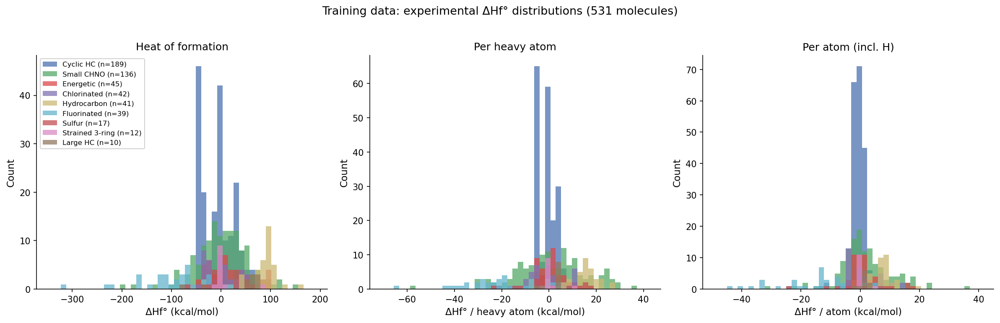
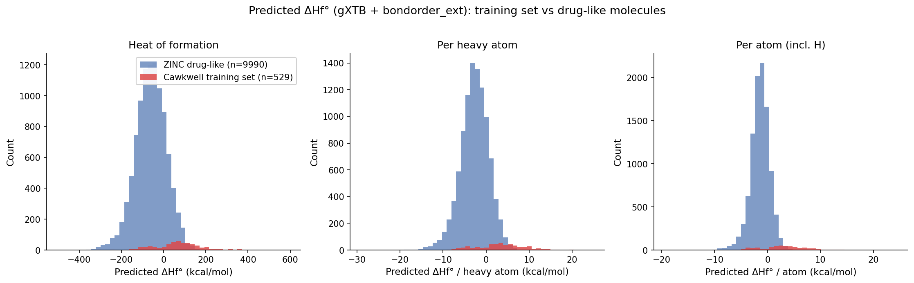
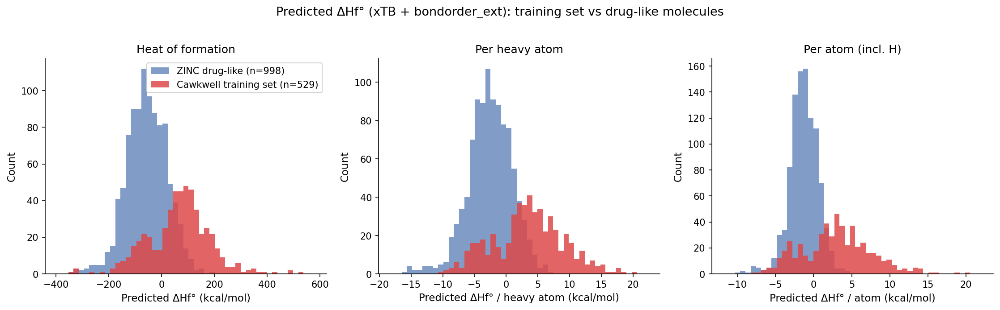

# Analysis

Scripts and data for visualising the deltahf training set and comparing predicted heats of formation across chemical domains.

---

## Training Data Distribution

**Script:** `plot_training_data.py`

```bash
python plot_training_data.py
```

The training data (`deltahf/data/training_data.csv`) contains 531 molecules across 9 categories: cyclic HC (189), small CHNO (136), energetic (45), chlorinated (42), hydrocarbon (41), fluorinated (39), sulfur (17), strained 3-ring (12), and large HC (10). The histograms below show experimental ΔHf°, ΔHf° per heavy atom, and ΔHf° per atom (including H), coloured by category. The cyclic hydrocarbons cluster tightly near zero per-atom ΔHf°, while the energetic and halogenated molecules span a much wider range.



---

## Comparing typical drug-like molecules with energetic CHNO molecules

**Script:** `plot_zinc_vs_cawkwell.py`

This script compares predicted ΔHf° distributions for two molecule sets:

- **Cawkwell energetic set** (531 molecules) — energetic CHNO molecules from Cawkwell et al. (2021)
- **ZINC drug-like sample** (10,000 molecules) — randomly sampled from the ZINC 250k drug-like dataset, filtered to supported elements and neutralised

The comparison assesses how the predicted ΔHf° distributions differ between energetic CHNO molecules and typical drug-like molecules.

### Usage

```bash
# Full pipeline: prepare inputs, run predictions, plot
python plot_zinc_vs_cawkwell.py

# Plot only (if predictions already exist)
python plot_zinc_vs_cawkwell.py --plot-only
```

By default the script uses gXTB + `bondorder_ext`. The `comparison_workflow` file contains commands for running the xTB variant separately.

### gXTB predictions

Using gXTB + `bondorder_ext`, the ZINC drug-like molecules tend toward more negative predicted ΔHf° than the Cawkwell energetic molecules. When normalised per heavy atom, the distributions overlap more substantially.



### xTB predictions

The same comparison using xTB + `bondorder_ext` shows a similar pattern. The distributions are broader due to the lower accuracy of xTB energies, but the relative shift between the Cawkwell and ZINC sets is consistent.



---

## Data Files

| File | Description |
|------|-------------|
| `250k_rndm_zinc_drugs_clean_3.csv` | ZINC 250k drug-like dataset (source data) |
| `zinc_sample_10000.csv` | 10,000-molecule random sample (neutralised, supported elements only) |
| `cawkwell_energetic.csv` | 531 energetic CHNO molecules from Cawkwell et al. (2021) |
| `cawkwell_gxtb_predictions.csv` | gXTB + bondorder_ext predictions for Cawkwell energetic set |
| `zinc_gxtb_predictions.csv` | gXTB + bondorder_ext predictions for ZINC sample |
| `comparison_workflow` | Shell commands for the xTB comparison workflow |
